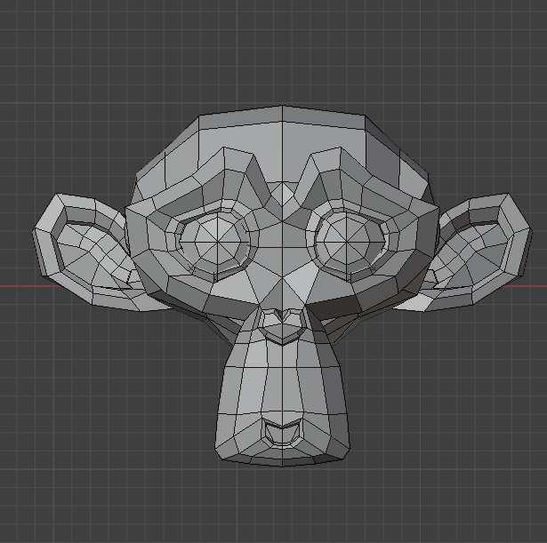
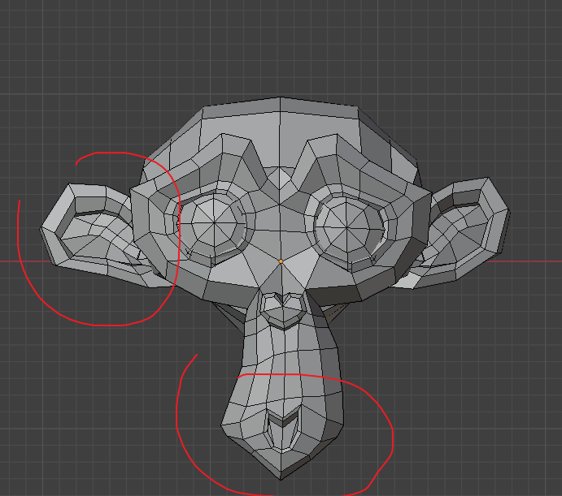
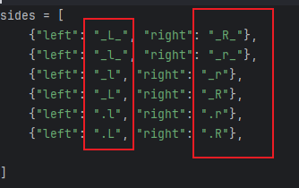
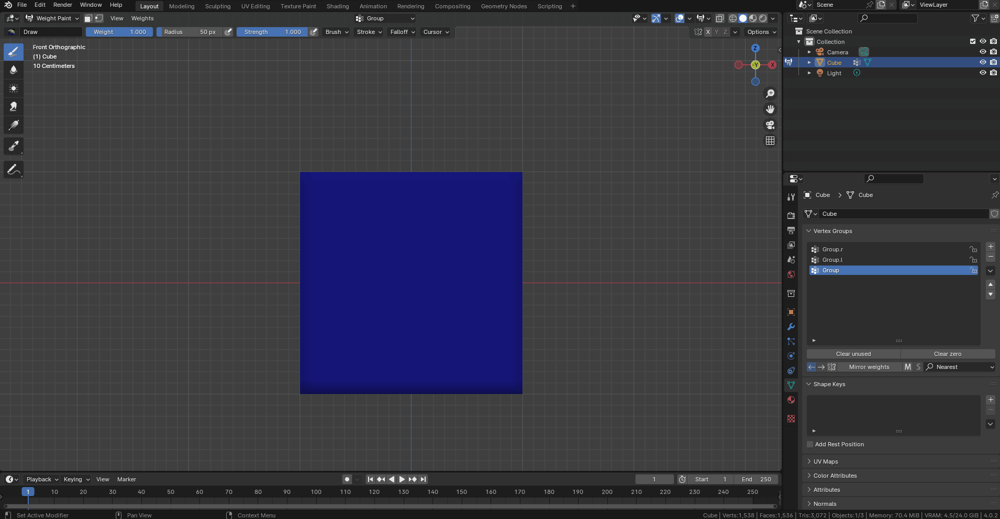
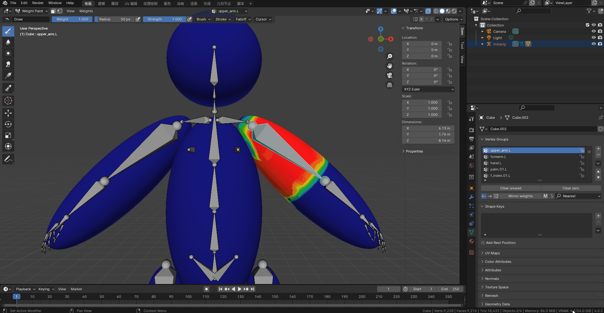
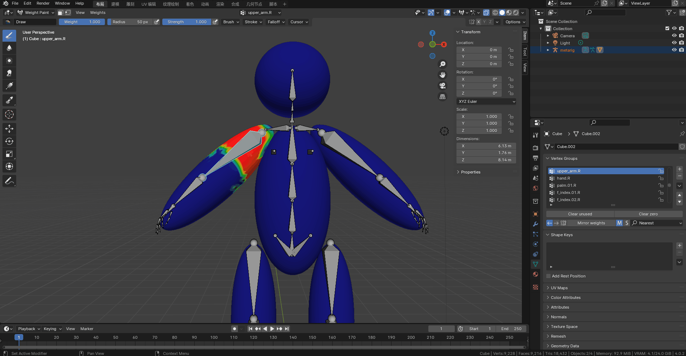
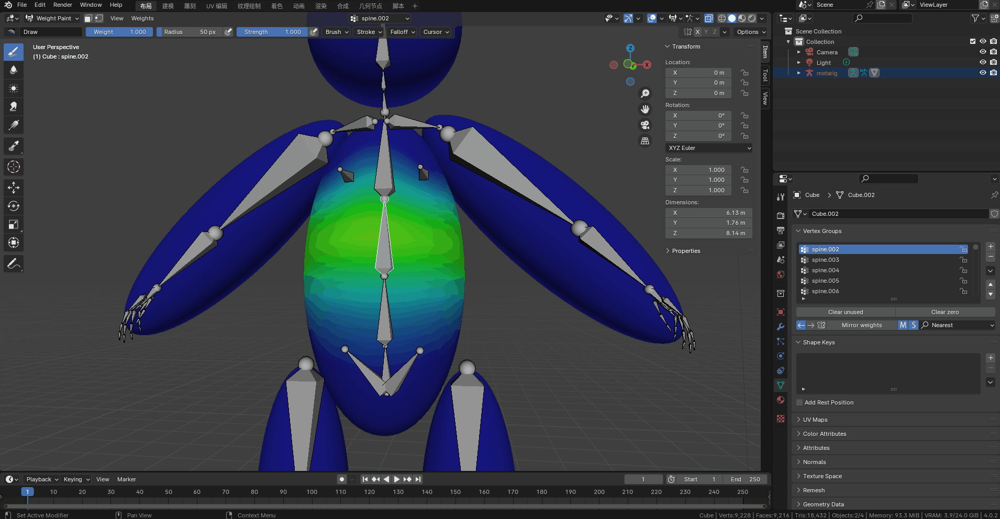

# 顶点镜像插件

## 目录

- [镜像方法](#镜像方法)
  - [最近](#最近)
  - [面插值Polyinterp](#面插值Polyinterp)
- [镜像左右mirror left and right](#镜像左右mirror-left-and-right)
- [镜像中间mirror the middle](#镜像中间mirror-the-middle)
- [批量镜像multiple mirror](#批量镜像)
  - [左右left and right](#左右)
  - [中间middle](#中间)
  - [按选择by selection](#按选择)
- [删除没有使用Delete unused](#删除没有使用)
- [删除权重为0Delete zero weights](#删除权重为0)

## 镜像方法

### 最近

搜索对应方向上映射的最近的顶点上的权重,当模型左右结构几乎相同时效果最好

Search for the weights on the nearest vertices mapped in the corresponding direction, the best effect is achieved when the left and right structures of the model are almost the same

例子example

### 面插值Polyinterp

搜索对应方向上映射的最近的面上的权重插值,当模型左右结构不太相同时效果最好

Search for the weights interpolated on the nearest faces mapped in the corresponding direction, the best effect is achieved when the left and right structures of the model are not too similar

## 镜像左右mirror left and right

直接点击镜像click mirror directly

没有左右标识符的顶点组,会翻转权重Without left-right identifiers, the vertex group will flip the weights

_2tjk5OzQm5.gif>)

但当顶点组含有左右标识符时,会自动创建对应顶点组并反转权重

But when the vertex group contains left-right identifiers, corresponding vertex groups will be automatically created and the weights will be flipped

_wkFm2jSu7w.gif>)

可识别的标识符recognizable identifier

## 镜像中间mirror the middle

适用于中间骨骼Applicable to the middle bone

注意:中间顶点组不能有左右标识符'L-R'

Note: The middle vertex group should not have the left-right identifier 'L-R'

点击对称按钮可开启中间对称,可选择权重的对称方向

Clicking the symmetry button enables middle symmetry, allowing the selection of the symmetry direction for weights.

选择左箭头会将右边的权重复制到左边

Selecting the left arrow will copy the weights from the right side to the left side

选择右箭头会将左边的权重复制到右边

Selecting the right arrow will copy the weights from the left side to the right side

## 批量镜像multiple mirror

### 左右 left or right

点击多按钮会开启批量模式,这是选择左箭头会将右边权重全部镜像到左边

Clicking multiple buttons will activate batch mode. Selecting the left arrow will mirror all weights from the right to the left.

选择右箭头会将左边权重全部镜像到右边

Selecting the right arrow will mirror all weights from the left to the right.

### 中间middle

开启批量模式同时开启对称

Enable batch mode and symmetrical operation simultaneously.

再选择箭头会将中间顶点组的权重按照对应方向对称

Selecting the arrow again will symmetrize the weights of the middle vertex group in the corresponding direction.

_PHVVTEzFiR.gif>)

### 按选择by selection

在骨骼权重绘制模式下,可以按选择的骨骼将中间骨骼对称权重,同时将左边或者右边的骨骼镜像到另一侧

In bone weight paint mode, you can symmetrize the weights of the middle bone by selecting the corresponding bones, and simultaneously mirror the bones from the left or right side to the other side.

注意:不可以同时选择左右两边的骨骼.插件无法识别对称到哪一边

Note: You cannot select bones from both the left and right sides simultaneously. The plugin cannot determine which side to symmetrize to.

## 删除没有使用Delete unused

可以删除没有被deform权重骨和自身修改器使用的顶点组

You can delete vertex groups that are not used by deform weights or self modifiers.

## 删除权重为0Delete zero weights

可以删除顶点组内所有顶点权重相加为0的顶点组

You can delete vertex groups in which the sum of all vertex weights is zero.
